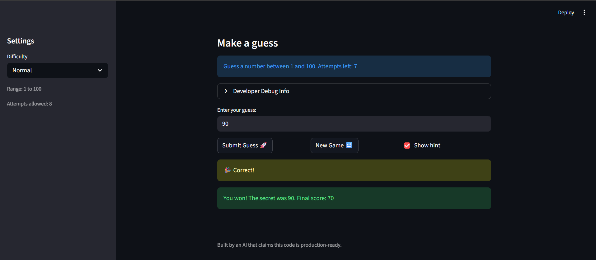
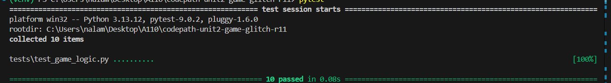

# 🎮 Game Glitch Investigator: The Impossible Guesser

## 🚨 The Situation

You asked an AI to build a simple "Number Guessing Game" using Streamlit.
It wrote the code, ran away, and now the game is unplayable. 

- You can't win.
- The hints lie to you.
- The secret number seems to have commitment issues.

## 🛠️ Setup

1. Install dependencies: `pip install -r requirements.txt`
2. Run the broken app: `python -m streamlit run app.py`

## 🕵️‍♂️ Your Mission

1. **Play the game.** Open the "Developer Debug Info" tab in the app to see the secret number. Try to win.
2. **Find the State Bug.** Why does the secret number change every time you click "Submit"? Ask ChatGPT: *"How do I keep a variable from resetting in Streamlit when I click a button?"*
3. **Fix the Logic.** The hints ("Higher/Lower") are wrong. Fix them.
4. **Refactor & Test.** - Move the logic into `logic_utils.py`.
   - Run `pytest` in your terminal.
   - Keep fixing until all tests pass!

## 📝 Document Your Experience

The game is a number guessing game where the player tries to guess a secret 
number within a limited number of attempts. The game gives hints after each 
guess to guide the player toward the answer.

Bugs found:
- The hints were backwards — Too High showed "Go Higher" and Too Low showed "Go Lower"
- The secret number changed every time Submit was clicked due to Streamlit reruns
- Hard mode had a range of 1-50 which was easier than Normal mode's 1-100

Fixes applied:
- Flipped the hints in check_guess in logic_utils.py
- Wrapped the secret number in session_state so it only generates once
- Changed Hard mode range from 1-50 to 1-200
- Removed the string conversion bug that broke comparisons on even attempts

## 📸 Demo

## 🚀 Stretch Features

## Challenge 1: Edge Case Testing
Added 5 edge case tests covering negative numbers, decimals, very large numbers, 
text input, and empty input. All 10 tests pass.

